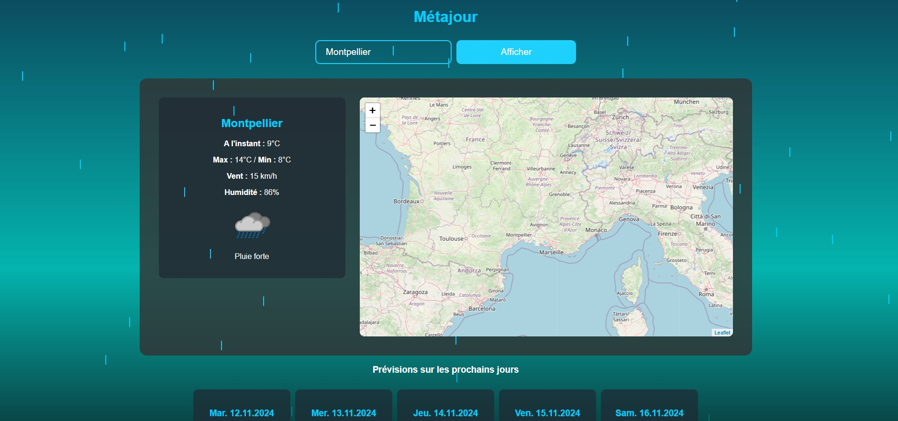

# Métajour

Métajour est une application météo construite avec HTML, CSS et JavaScript. Elle permet aux utilisateurs de rechercher les conditions météorologiques d'une ville spécifique ou d'afficher la météo à leur emplacement actuel grâce à la géolocalisation. L'application fournit une vue de la carte, les prévisions météorologiques d'aujourd'hui et celles pour les prochains jours.

## Fonctionnalités

- **Recherche météo par ville** : Entrez un nom de ville pour obtenir la météo actuelle et les prévisions futures.
- **Support de la géolocalisation** : Utilise l'emplacement actuel de l'utilisateur pour afficher les données météorologiques locales.
- **Carte dynamique** : Carte interactive (grâce à Leaflet) pour sélectionner des emplacements et afficher les informations météorologiques en cliquant sur la carte.
- **Prévisions météo** : Affiche les conditions météorologiques actuelles et les prévisions sur 5 jours.
- **Animation de pluie** : Un effet visuel de pluie est affiché si des précipitations sont prévues.

## Technologies Utilisées

- **HTML5**
- **CSS3** : Pour la mise en page, les animations et la réactivité.
- **JavaScript** : Pour gérer les requêtes de données météorologiques, les interactions avec la carte et les animations.
- **Leaflet.js** : Pour afficher la carte interactive.
- **API Nominatim** : Utilisée pour la géocodification inverse afin de trouver les noms des villes en fonction de la latitude et de la longitude.
- **API Prévision Météo** : Pour récupérer les données météorologiques.
